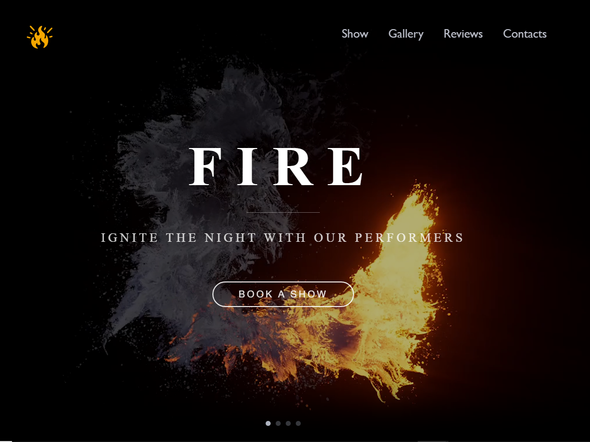

# Fire show landing page

A visually striking and animated landing page for a fire show event or team. Built with modern technologies and styled to reflect the fiery theme through animations, gradients, and dynamic video background.

##  Features

- Full-screen video background with smooth transitions
- Interactive Swiper.js slider with GSAP-controlled video sync
- Animated golden hover effects on navigation links
- Custom animated logo with fire-themed gradient glow
- Fully responsive layout (base structure)

##  Technologies Used

- **HTML5** — semantic structure
- **CSS3** — custom styles, gradients, hover effects, responsive typography
- **JavaScript (ES6)** — swiper navigation and video animation logic
- **GSAP** — smooth transitions (video sync)
- **Swiper.js** — slider implementation
- **SVG logo** — scalable vector logo
- **Responsive Design** — `vw`, `vh`, `calc()`, flexbox
